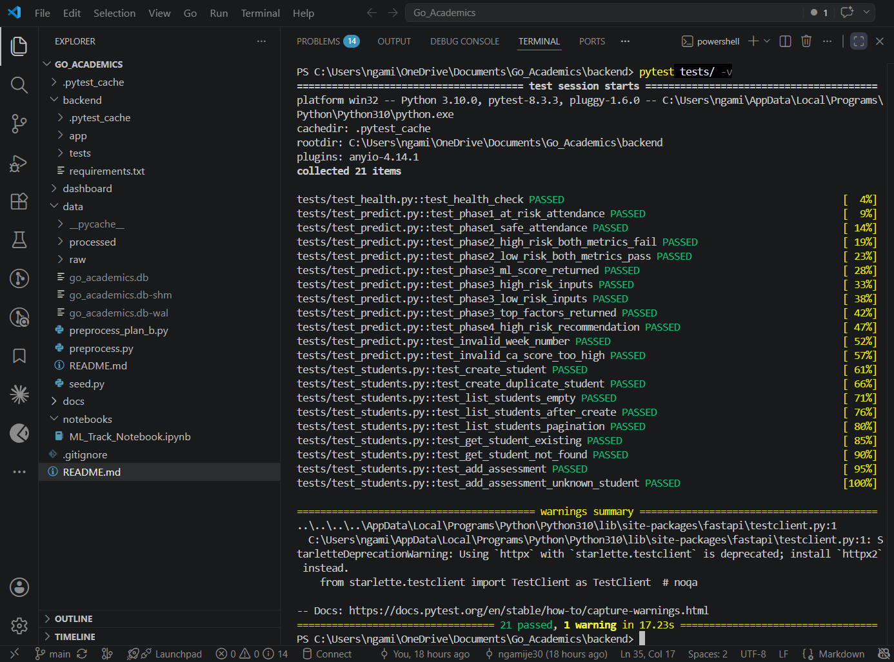
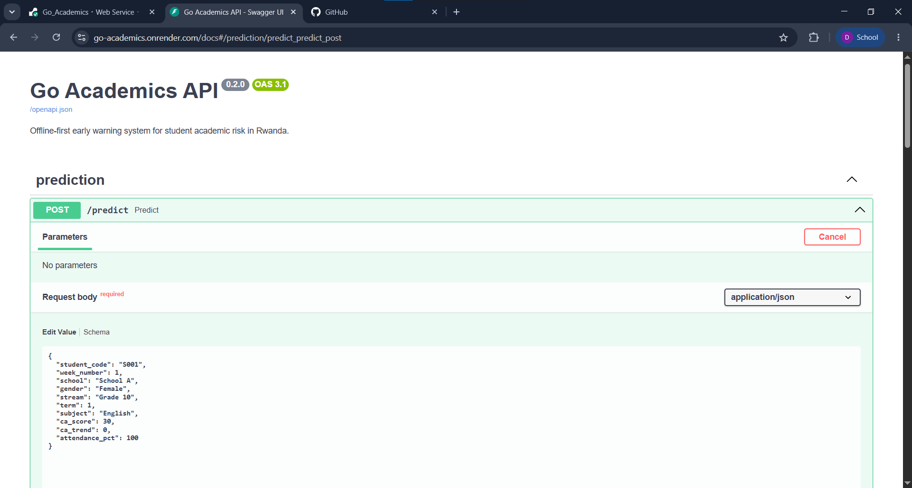
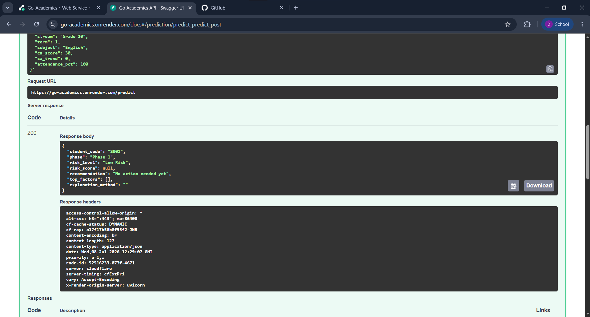
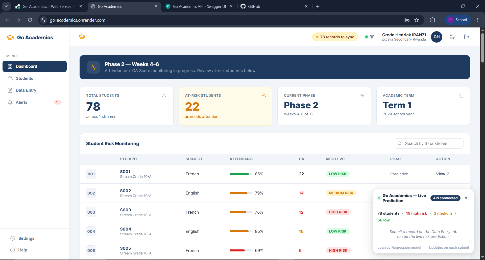
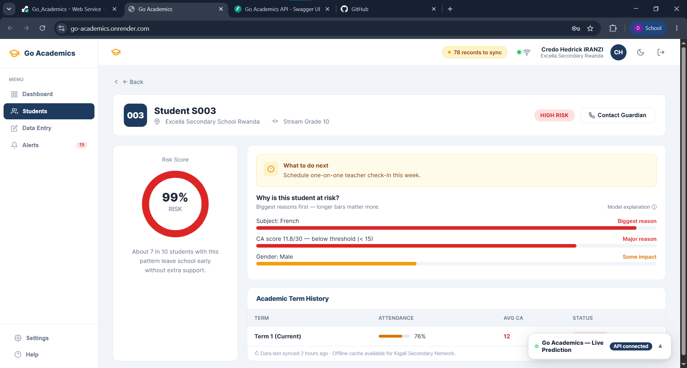
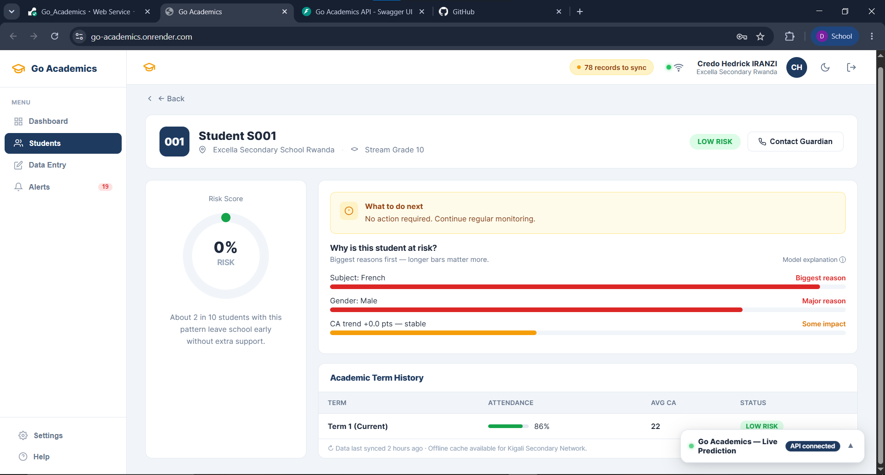
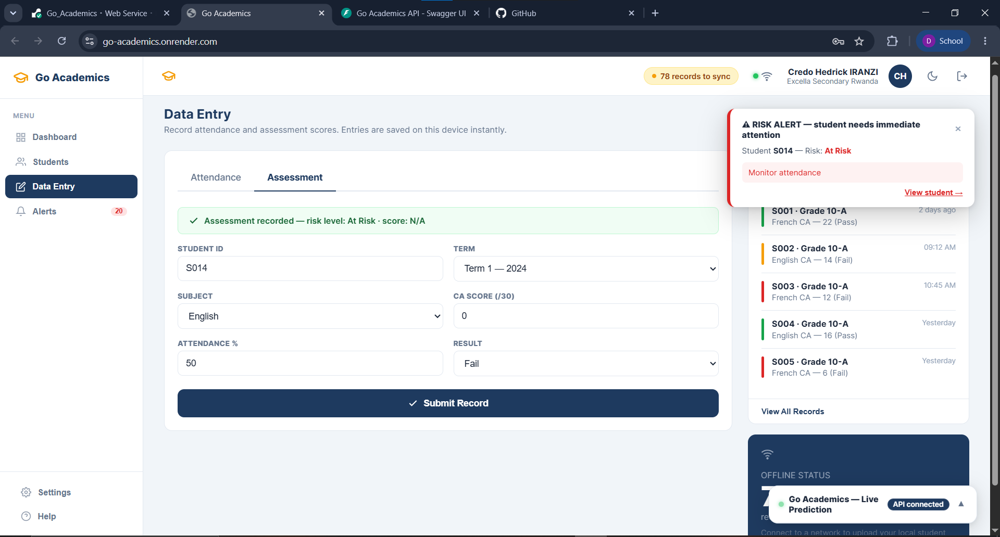
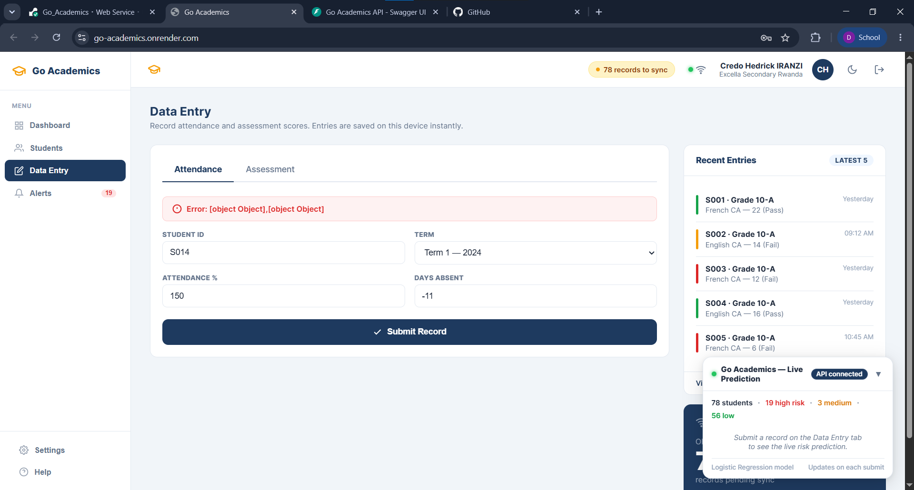
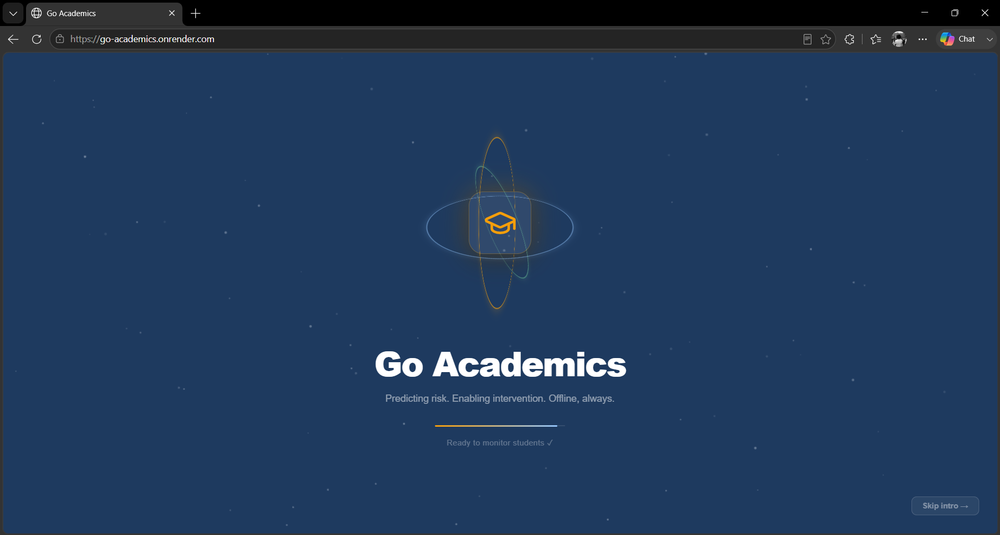
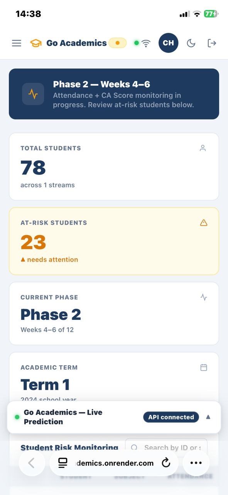

# Go Academics

**Offline-first ML early warning system for student academic risk in Rwanda.**

Predicts at-risk secondary school students across four structured phases of the academic term and delivers actionable alerts to teachers — before end-of-term exams.

> Capstone project — ALU BSc Software Engineering · NGAMIJE RUHUMULIZA Davy

---

## Live demo

**Deployed app:** [https://go-academics.onrender.com](https://go-academics.onrender.com)
(Free-tier hosting — the first request after a period of inactivity can take 30–60s to wake up.)

**Demo video:** https://www.loom.com/share/8869897bd33f4d6ba2e9475211e1fecb

> **Note:** this live demo runs on Render (cloud) for presentation convenience, which
> requires an internet connection to reach. In its intended production setting, Go
> Academics runs on a school's own local server, so teachers on the school's network
> need no internet access at all — see CLAUDE.md for the offline-first architecture.

---

## What it does

| Phase | Weeks | Method | Trigger |
|-------|-------|--------|---------|
| 1 | 1–3 | Rule-based | Attendance < 80% |
| 2 | 4–6 | Rule-based | Attendance < 80% **or** CA < 15/30 |
| 3 | 7–9 | ML (best of Logistic Regression / Random Forest / XGBoost, picked by recall — see `/model-info`) | Risk score ≥ medium threshold |
| 4 | 10–12 | Same ML model | Risk score ≥ high threshold + intervention recommendation |

Exact thresholds are derived from the precision-recall curve at training time (not
hardcoded) — check `backend/app/ml/saved_models/model_meta.json` or `GET /model-info`
on the running app for the current values.

---

## Prerequisites

- Python 3.10+
- pip (comes with Python)
- A modern browser (Chrome/Edge recommended)

---

## Setup (first time only)

### 1. Install dependencies

```bash
cd backend
pip install -r requirements.txt
```

### 2. Prepare the dataset

Real school term files live in `data/raw/` already, named `<school>_term<N>.csv`
(e.g. `excella_school_a_term1.csv`), matching the Go Academics column schema.
To add a new school or term, drop the file in `data/raw/` and register the
real school name in `SCHOOL_CODES` in `data/preprocess.py` if it's new.

Then run preprocessing:
```bash
python data/preprocess.py
```

This creates:
- `data/processed/students.csv` — anonymized, human-readable
- `data/processed/students_ml.csv` — SMOTE-balanced for training
- `data/processed/encodings.json` — category encodings used by inference

(If real data collection for a school/term is delayed, the UCI-based Plan B
pipeline is still available via `python data/preprocess_plan_b.py` — see
`docs/plan_b.md`.)

### 3. Train the ML model

```bash
python backend/app/ml/train.py
```

Trains Logistic Regression, Random Forest, and XGBoost, and picks the best by recall (tiebreak F1). Saved to `backend/app/ml/saved_models/best_model.pkl`.

### 4. Seed the database

```bash
python data/seed.py
```

Creates `data/go_academics.db` and populates it with all 78 real Excella students from
`data/processed/students.csv` — assessments, attendance, and risk scores are computed by
the actual trained model, not fabricated.

---

## Running the system

The FastAPI backend serves the dashboard's static HTML directly (see
`backend/app/main.py`), so there's only one server to run — no separate
frontend host, no cross-origin requests.

```bash
cd backend
python -m uvicorn app.main:app --port 8000 --reload
```

On first startup, if the database is empty, it auto-seeds all 78 real
Excella students (see `_seed_if_empty()` in `main.py`) — no manual seed
step needed.

Open your browser to:
```
http://localhost:8000/
```

Interactive API docs: `http://localhost:8000/docs`

The live prediction widget appears in the bottom-right corner of the dashboard. A green dot confirms the API is connected.

---

## Deployment

Deployed as a single [Render](https://render.com) Web Service — one repo, one
build, one URL:

| Setting | Value |
|---|---|
| Root Directory | `backend` |
| Build Command | `pip install -r requirements.txt` |
| Start Command | `uvicorn app.main:app --host 0.0.0.0 --port $PORT` |
| Instance Type | Free |

Render clones the whole repo regardless of Root Directory, so the dashboard
(`dashboard/`) and data (`data/`) folders are available to the backend at
runtime via relative paths from `main.py`. No environment variables are
required — the app has no API keys or external secrets.

---

## Project structure

```
Go_Academics/
├── backend/
│   ├── app/
│   │   ├── main.py              # FastAPI entrypoint — also mounts dashboard/ as static files
│   │   ├── db.py                # SQLite session factory
│   │   ├── models/database.py   # SQLAlchemy models
│   │   ├── ml/
│   │   │   ├── train.py         # Training pipeline
│   │   │   ├── predict.py       # Inference + risk factors
│   │   │   └── saved_models/    # best_model.pkl + model_meta.json
│   │   ├── routes/
│   │   │   ├── predict.py       # POST /predict (phase-aware)
│   │   │   ├── students.py      # GET/POST /students
│   │   │   └── model_info.py    # GET /model-info (live model identity + metrics)
│   │   └── data/phase_logic.py  # Four-phase rule engine
│   └── requirements.txt
├── data/
│   ├── raw/                     # Real school term CSVs + UCI fallback files
│   ├── processed/               # Preprocessed CSVs + encodings.json
│   ├── preprocess.py            # Real data → Go Academics pipeline (active)
│   ├── preprocess_plan_b.py     # UCI fallback pipeline (inactive)
│   └── seed.py                  # Seeds all 78 real students with model-predicted risk scores
├── dashboard/
│   └── index.html               # Teacher dashboard (served by the backend, offline-capable)
├── docs/
│   └── ML_Track_Notebook.ipynb  # ML demo notebook (Initial Software Demo)
└── CLAUDE.md                    # Project memory and conventions
```

---

## API endpoints

| Method | Endpoint | Description |
|--------|----------|-------------|
| GET | `/health` | Liveness check |
| POST | `/predict` | Phase-aware risk prediction |
| GET | `/students` | List all students |
| POST | `/students` | Add a student |
| GET | `/students/{code}` | Student detail + latest risk |
| POST | `/students/{code}/assessment` | Record CA score + attendance |
| DELETE | `/students/{code}` | Delete a student and their records |
| GET | `/model-info` | Currently deployed model's identity + live metrics |

---

## Data privacy

- No real student names or national IDs are stored anywhere
- Students are identified by anonymised codes only (S001, S002, …)
- Schools are referred to by anonymized codes ("School A", …) in all raw data, the
  database, CSVs, and model encodings. "School A" is the internal system code for
  Excella Secondary School Rwanda — the dashboard UI displays the real name to
  teachers (`SCHOOL_DISPLAY_NAMES` in `dashboard/index.html`), but nothing else
  (data files, API payloads, model training) ever uses it. Keep this in mind before
  screenshotting the dashboard into anything that should stay anonymized.
- Current data is one pilot school, Excella Secondary School Rwanda, located in Kigali (urban context)

---

## Tech stack

- **Backend**: FastAPI + SQLAlchemy + SQLite, served with Uvicorn
- **ML**: scikit-learn (Logistic Regression / Random Forest) · XGBoost · imbalanced-learn (SMOTE)
- **Frontend**: plain HTML/CSS/JavaScript, no build step — served directly by the FastAPI backend, runs fully offline
- **Data**: real anonymized Kigali school records (Plan A); UCI Student Performance Dataset kept as an inactive Plan B fallback
- **Deployment**: Render (single Web Service, free tier)

---

## Testing results

All screenshots below are from the live deployed app at `go-academics.onrender.com`, not localhost.

### Testing strategies

| | |
|---|---|
|  **Automated tests** — 21 tests passing (unit + integration, covering rule-based phases, ML phases, CRUD, and validation) |  **API contract testing** — `POST /predict` via the interactive `/docs` UI |
|  **Live API response** — real request against the deployed model, returning `Low Risk` for a Phase 1 (rule-based) input |  **Manual UI testing** — dashboard loaded against the live API, showing all 78 real students |

### Different data values

| | |
|---|---|
|  **High-risk student** (S003) — 99% risk score with model explanation: low CA score, subject, and gender ranked by contribution |  **Low-risk student** (S001) — 0% risk score, same model, different real inputs |
|  **Live prediction on submit** — a new assessment (S014) triggers an immediate risk alert computed by the real trained model, not canned data |  **Invalid input rejected** — out-of-range values (150% attendance, -11 days absent) are rejected rather than silently accepted |

### Performance across hardware/software

| | |
|---|---|
|  **Different browser** — Microsoft Edge (development/testing was primarily done in Chrome) |  **Different device** — live URL open on an actual phone, after adding a responsive layout (collapsible nav, stacked grids, scrollable tables) |

**Note on the validation-error screenshot:** the frontend currently surfaces the raw error object (`[object Object]`) instead of a formatted message when the backend rejects a request — the *rejection itself* works correctly (bad data is never accepted), but the error display is a known cosmetic issue, not a functional one.
